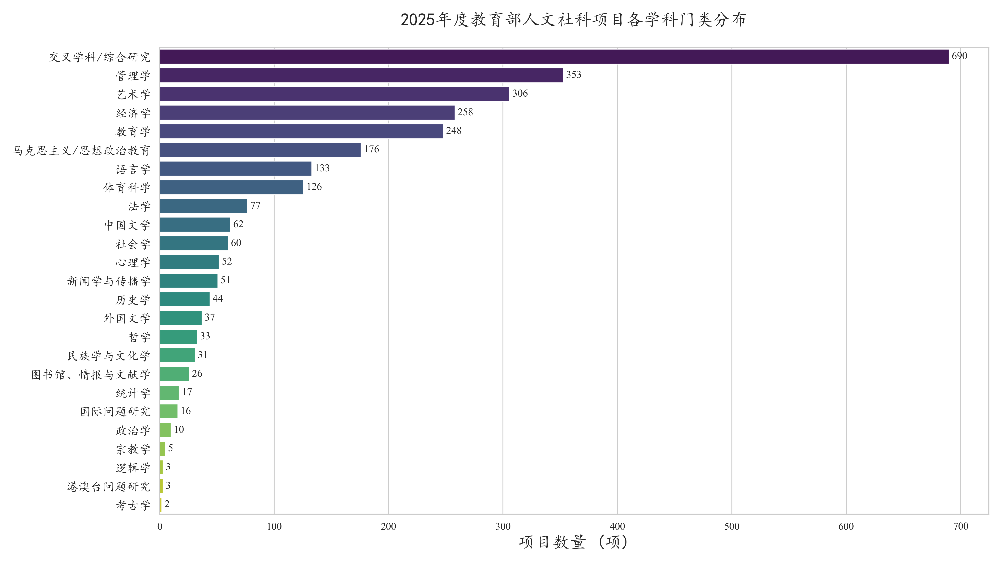
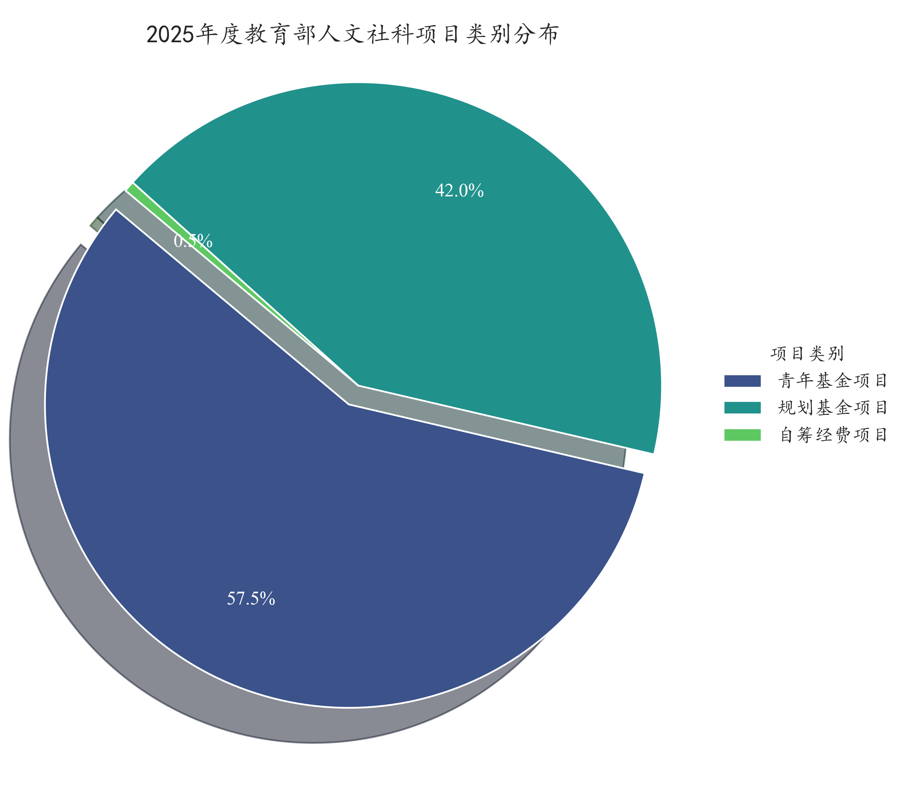
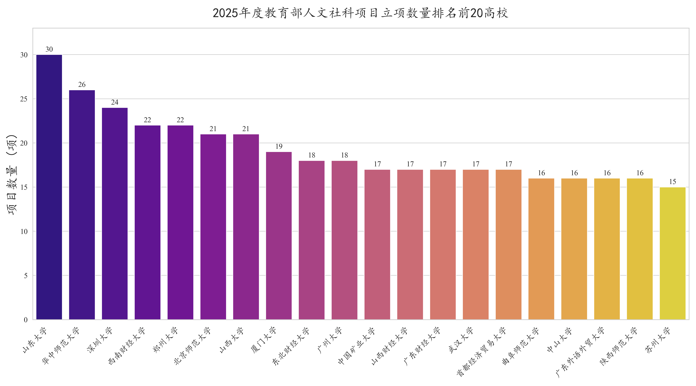
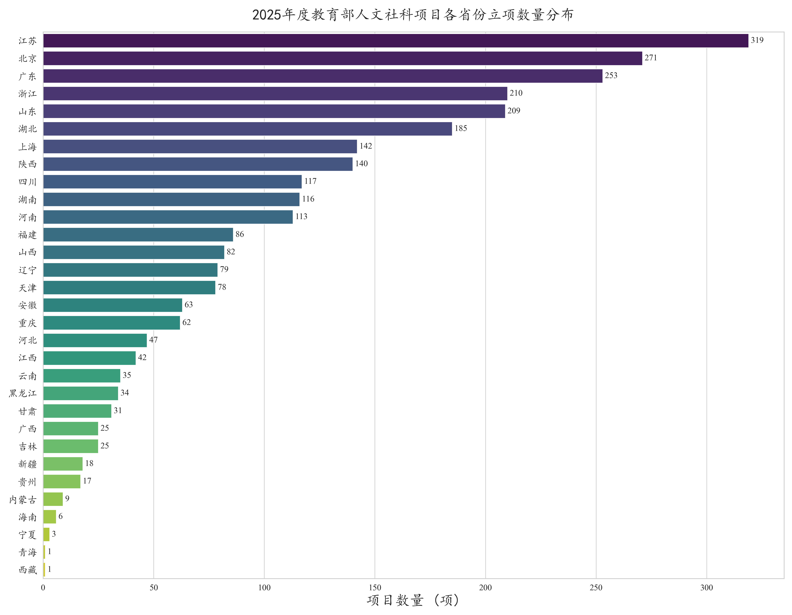
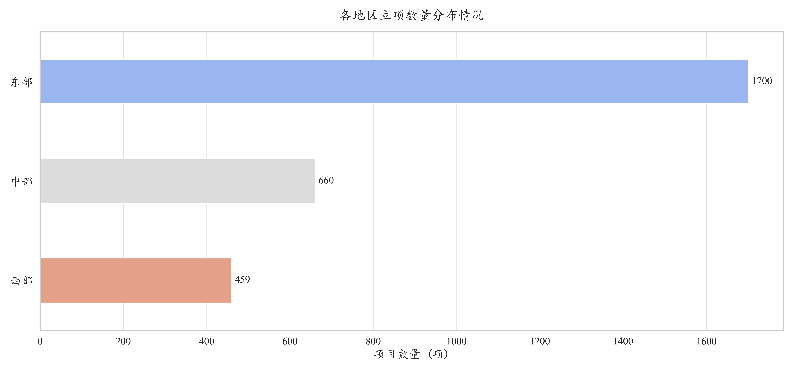
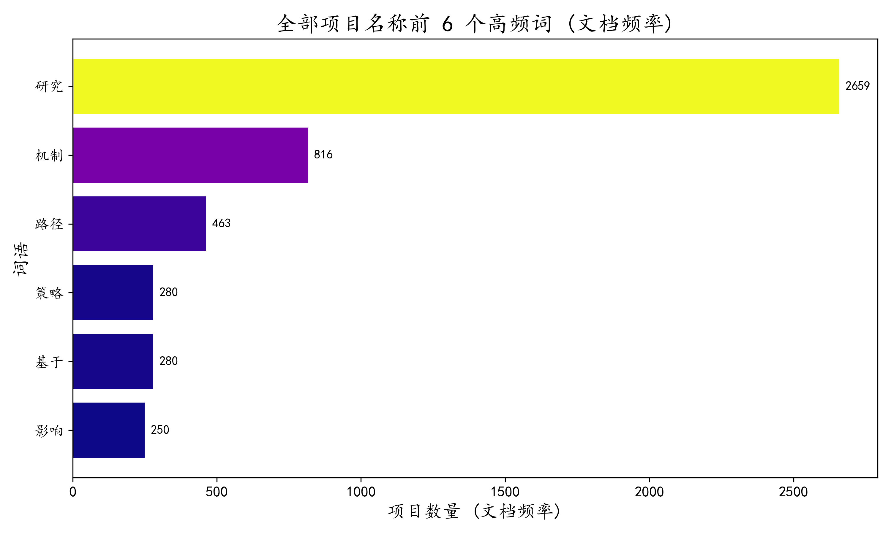
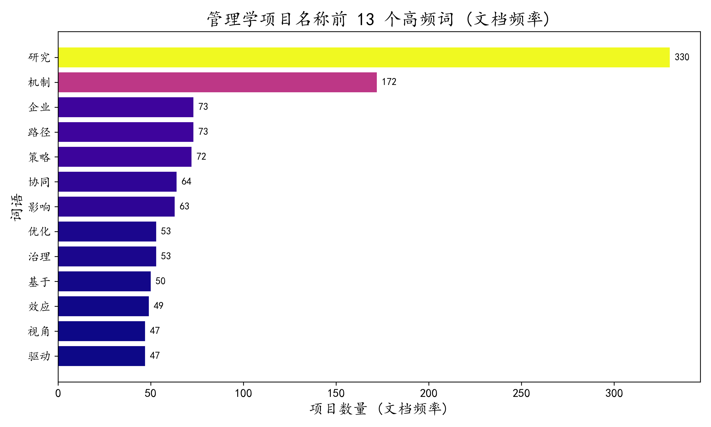
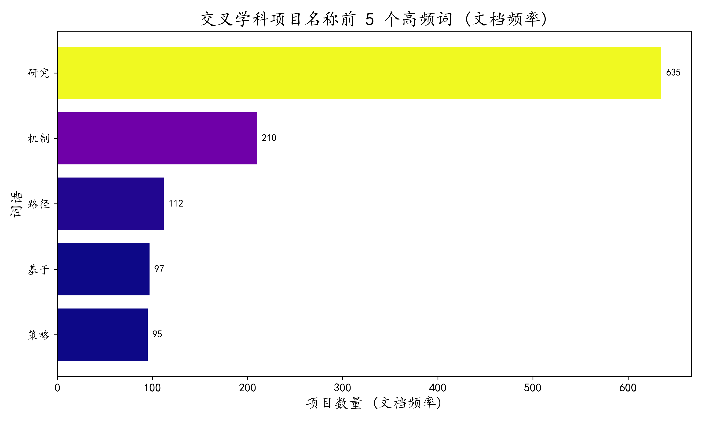

# 2025年度教育部人文社科基金立项数据可视化

本文集是微信公众号文章 **《2025年度教育部人文社会科学项目立项结果可视化分析》** 的配套高清可视化图表库。所有图表均可点击放大查看，交互式网络图可进入专属页面进行探索。

---

## 🔗 代码与数据下载 (Code & Data Download)

为了方便同行对本研究进行复现或扩展，我们提供了完整的分析代码与所用数据。

* [**<big>💾 下载分析代码 (code.zip)</big>**](./downloads/code.zip)
* [**<big>📊 下载项目数据 (data.zip)</big>**](./downloads/data.zip)

> **运行建议：**
> 本项目代码与数据环境较为标准。建议直接将 `code.zip` 和 `data.zip` 上传并解压至 **Kaggle** 或 **阿里云魔搭 (ModelScope)** 的 Notebook 环境中，根据解压后的实际路径，修改代码文件开头部分的文件读取地址，即可直接运行，复现全部结果。

---

## 一、宏观鸟瞰分析 (Macro Overview)

 

### 1. 各学科门类分布

### 2. 项目类别分布

### 3. 机构分布 (TOP 20)

### 4. 地域分布

---

## 二、项目名称高频词分析 (High-Frequency Word Analysis)

 

### 1. 全部项目高频词
**词频统计**

**词云概览**

### 2. 管理学项目高频词
**词频统计**

**词云概览**

### 3. 交叉学科项目高频词
**词频统计**

**词云概览**

---

## 三、关键词共现网络 (Keyword Co-occurrence Networks)

为了获得最佳体验，请点击下方链接在新窗口中打开动态交互式网络图。

 

### 1. 全部项目关键词共现网络

[**<big>🔗 点击此处，打开“全部项目”动态交互式网络图</big>**](./interactive/interactive_keyword_network_overall.html){:target="_blank"}

### 2. 管理学项目关键词共现网络

[**<big>🔗 点击此处，打开“管理学项目”动态交互式网络图</big>**](./interactive/interactive_keyword_network_management.html){:target="_blank"}

### 3. 交叉学科项目关键词共现网络

[**<big>🔗 点击此处，打开“交叉学科项目”动态交互式网络图</big>**](./interactive/interactive_keyword_network_cross.html){:target="_blank"}

---
_分析与可视化 by [Ryan], [2025-09-28]_
